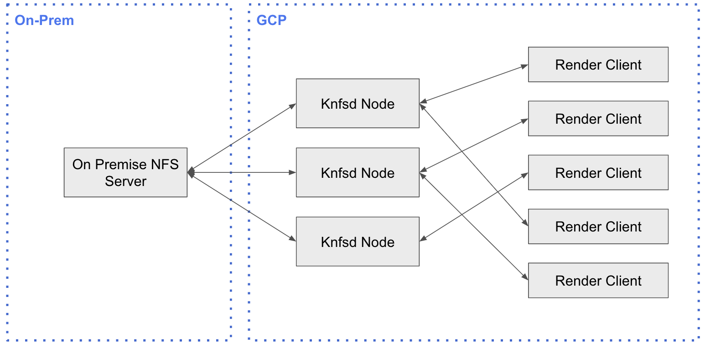
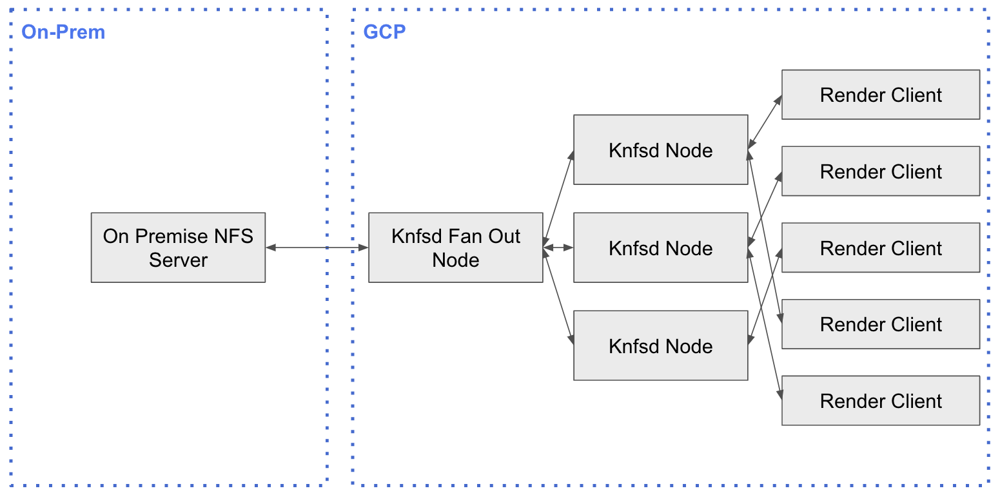

# Fan Out Architecture

## Overview

In the standard architecture, one layer of Knfsd Caches are deployed that sit between the downstream clients and the on-premise NFS server. This approach is shown in the below diagram:



This approach is the simplest deployment architecture, and also the most performant when it comes to reading uncached files, and writing files back through to the on-premise NFS server.

However in this model, as the Knfsd nodes in a cluster do not share cached items with eachother, having multiple Knfsd nodes means that often files are transferred across the network multiple times. This is because different downstream clients might be connected to different Knfsd nodes, meaning that even if 2 downstream clients are requesting the same file, that file may need to be pulled from on-premise twice.

One approach to mitigating this challenge is to deploy two Knfsd clusters in a "fanout" architecture. This approach is shown in the below diagram:



In this architecture, a single Knfsd node is deployed that is responsible for all communication back to the on-premise filer (the fanout node). A second Knfsd cluster is then deployed that connects to this fanout node. Downstream clients all connect to this second cluster.

This architecture mitigates the challenges around duplicate file transfers from on-premise. The fanout node acts as the primary cache, and the second cluster is deployed to prevent overloading the fanout cache. This reduces the volume of data that needs to be transferred over the interconnect.

## Considerations

While this architecture can provide performance benefits for certain use-cases, there are some considerations that need to be made:

1. The Knfsd fanout node has the potential to act as a performance botleneck.
2. First time reads, and writes back to on-premise will be less performant as there is an additional hop involved.
3. The cost of running the Knfsd infrastructure will increase due to additional nodes (however this may be offset by enabling a smaller interconnect link).
4. Adding an additional re-export layer adds up to an additional 25 bytes to the filehandle. This means that NFSv4 must be used for the re-exports as NFSv3 has a 64-byte filehandle size limit.

## Example Deployment of Fanout Architecture

There is no special logic in the Knfsd Terraform Module to handle the fanout architecture. Instead the module is defined twice to achieve the fanout deployment. The below code block shows an example deployment of the fanout architecture.

1. The module `nfs_proxy_fanout` defines the fanout cluster responsible for connecting to on-premise.
2. The module `nfs_proxy_cluster` defines the cluster that connects to the fanout node. Downstream clients all connect to this cluster.

```terraform
module "nfs_proxy_fanout" {

  source = "github.com/GoogleCloudPlatform/knfsd-cache-utils//deployment/terraform-module-knfsd?ref=v1.0.0-beta8"

  # Google Cloud Project Configuration
  PROJECT = "my-gcp-project"
  REGION  = "us-west1"
  ZONE    = "us-west1-a"

  # Network Configuration
  NETWORK                    = "my-vpc"
  SUBNETWORK                 = "my-subnet"
  AUTO_CREATE_FIREWALL_RULES = false

  # Knfsd Proxy Configuration
  PROXY_IMAGENAME = "knfsd-base-image"

  # Fanout Specific Configuration
  CACHEFILESD_DISK_TYPE               = "pd-balanced"                          // Use a Persistent Disk as we want the fanout node to have a larger cache
  CACHEFILESD_PERSISTENT_DISK_SIZE_GB = 5120                                   // Use a large PD to maximise cache hits
  MACHINE_TYPE                        = "n2-highmem-32"                        // Use a higher CPU and Memory machine type to increase fanout performance
  ENABLE_HIGH_BANDWIDTH_CONFIGURATION = true                                   // Use a higher bandwidth configuration
  KNFSD_NODES                         = 1                                      // Only deploy 1 node in the cluster because we want a single fanout node
  EXPORT_MAP                          = "10.0.5.5;/remoteexport;/remoteexport" // Define the exports in the standard way
  PROXY_BASENAME                      = "rendercluster1-fanout"                // Give this proxy a unique base name
  ENABLE_UDP                          = true                                   // Enable UDP on the fanout cluster as we need to respond to showmount which listens on UDP only
  DISABLED_NFS_VERSIONS               = "3,4.0,4.2"                            // Only allow NFSv4.1 on exports due to additional filehandle size

}

module "nfs_proxy_cluster" {

  source = "github.com/GoogleCloudPlatform/knfsd-cache-utils//deployment/terraform-module-knfsd?ref=v1.0.0-beta8"

  # Google Cloud Project Configuration
  PROJECT = "my-gcp-project"
  REGION  = "us-west1"
  ZONE    = "us-west1-a"

  # Network Configuration
  NETWORK                    = "my-vpc"
  SUBNETWORK                 = "my-subnet"
  AUTO_CREATE_FIREWALL_RULES = false

  # Knfsd Proxy Configuration
  PROXY_IMAGENAME = "knfsd-base-image"

  ## Cluster Specific Configuration
  CACHEFILESD_DISK_TYPE   = "local-ssd"                                             // Use Local SSD for a higher performance cache
  LOCAL_SSDS              = 6                                                       // Keep a smaller cache than normal because we have the fanout node storing the bulk of the data
  MACHINE_TYPE            = "n1-highmem-16"                                         // Use a smaller CPU and memory machine type as we have multiple nodes in the cluster
  KNFSD_NODES             = 3                                                       // Deploy more than 1 knfsd node for the standard cluster
  EXPORT_HOST_AUTO_DETECT = module.nfs_proxy_fanout.nfsproxy_loadbalancer_ipaddress // Automatically detect the exports from the fanout node
  PROXY_BASENAME          = "rendercluster1"                                        // Give this cluster a unique base name
  DISABLED_NFS_VERSIONS   = "3,4.0,4.2"                                             // Only allow NFSv4.1 on exports due to additional filehandle size
  NFS_MOUNT_VERSION       = "4.1"                                                   // Mount the fanout node as NFSv4.1 due to filehandle size limitations in NFSv3

}


// Prints the IP address of the Load Balancer for the cluster clients will connect to
output "load_balancer_ip_address" {
  value = module.nfs_proxy_cluster.nfsproxy_loadbalancer_ipaddress
}

// Prints the DNS address of the Load Balancer for the cluster clients will connect to
output "load_balancer_dns_address" {
  value = module.nfs_proxy_cluster.nfsproxy_loadbalancer_dnsaddress
}
```
