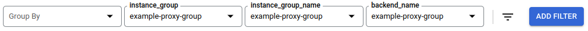

# metrics

This directory contains a standalone Terraform Configuration that is used for setting up the Google Cloud Monitoring [Metric Descriptors](https://cloud.google.com/monitoring/custom-metrics/creating-metrics#creating_a_metric_descriptor) and Monitoring Dashboard.

**This Terraform Configuration only needs to be applied once per Google Cloud Project, regardless of the number of Knfsd deployments you have in the project**. You also do not need to destroy this configuration if you cease to use Knfsd in your project.

## Usage

1. Checkout this repository locally (`git clone git@github.com:GoogleCloudPlatform/knfsd-cache-utils.git`)
2. Navigate to this directory (`deployment/metrics/`)
3. Edit [provider.tf](provider.tf) and update the `project` field to match your Google Cloud Project
4. If you are **not** using Cloud Shell, or a local machine with [gcloud](https://cloud.google.com/sdk/gcloud) installed and authenticated uncomment the `credentials` field and update the file path to the Service Account you generated as part of the [main deployment instructions](../README.md#generate-service-account)
5. Run `terraform init`
6. Run `terraform apply` to create the Metric Descriptors and Import the Dashboard
7. Return to the [main deployment instructions](../) to continue setup

## Filtering

If you have deployed multiple knfsd proxy clusters within the same project then the dashboard will show all the knfsd proxy clusters.

To filter by a specific knfsd proxy cluster add the following filters to the dashboard with the value `{PROXY_BASENAME}-proxy-group`.

* System Metadata Label, `instance_group`
* Resource, `instance_group_name`
* Resource, `backend_name`

For example, if the knfsd proxy cluster was deployed with `PROXY_BASENAME = "example"` then the filter value is `example-proxy-group`.

## Caveats

### Dashboard shows unrelated load balancers and instance groups

Metrics based on resources that do not support labels such as the knfsd proxy latency (load balancer) and knfsd proxy cluster size (instance group) are filtered based upon the instance group name ending with the suffix `-proxy-group`.

If you have other instance groups that end with the suffix `-proxy-group` these instances groups will also be included in some of the graphs.
