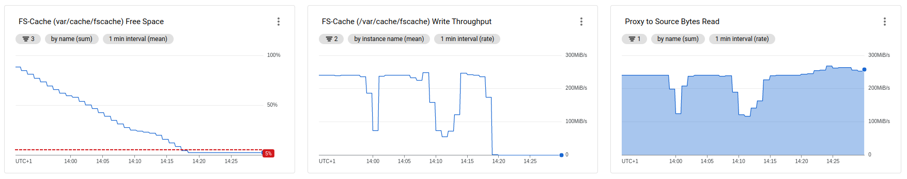
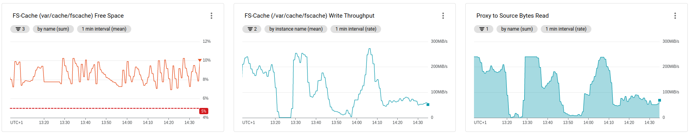
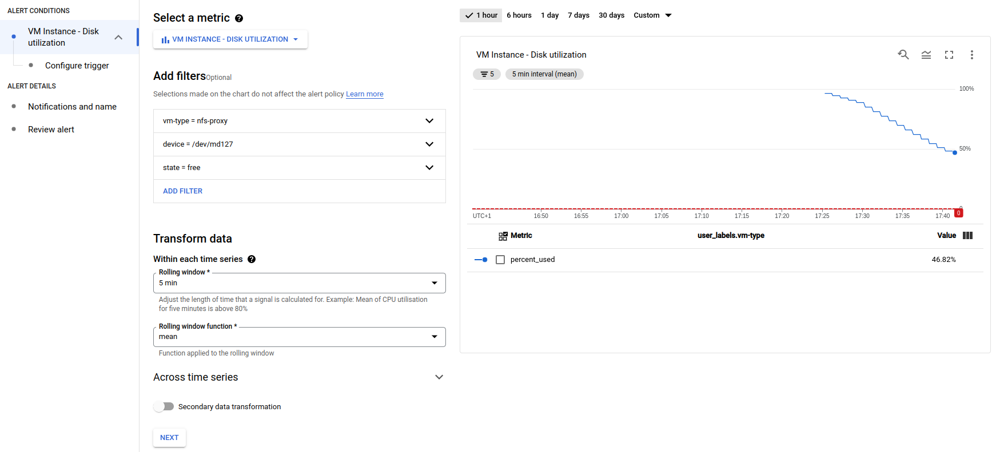
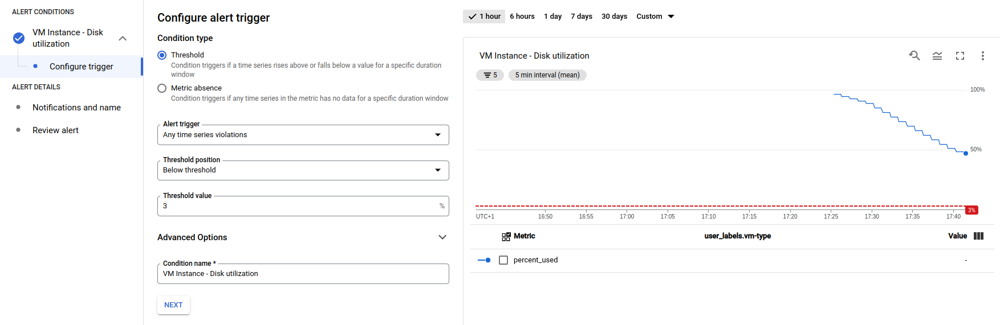

# Culling

When the cache runs out of space cachefilesd will cull (delete) old blocks from the cache that are no longer in use to free up cache space for new files.

In kernel versions before 5.17 cachefilesd may stop culling files when the disk is full. The proxy will continue to function and serve files. Any data already in the cache may be served by the cache. For all other requests the proxy will need to fetch the data from the source.

In 5.17 FS-Cache was re-wrote and no longer appears to have the culling issue. However, the new implementation is limited to about 30~40 MB/s per process at the moment.

## Culling Configuration

Culling is configured by two sets of three variables:

* `brun`, `frun`; when to stop culling (i.e. run culling until x%).
* `bcull`, `fcull`; when to start culling.
* `bstop`, `fstop`; when to stop *caching*.

The defaults for the Knfsd Proxy are 20% (run), 7% (cull), and 3% (stop).

`brun`, `bcull`, and `bstop` are based on a percentage of available blocks. Each block is 4 KB by default (this is based upon the kernel's page size).

`frun`, `fcull`, and `fstop` are base on a percentage of available files (on ext4, this is a percentage of inodes).

Culling will begin when the available space is less than 7%, and will continue to cull until the available space reaches 20%. If the available space goes below 3% FS-Cache will stop caching until the available space rises above 3%.

For full details on configuring culling see `man 5 cachefilesd.conf`.

## Detecting when culling stops

There are three metrics that can be used to tell if the system has stopped culling.

* FS-Cache Free Space (`agent.googleapis.com/disk/percent_used`, filter on `device = /dev/md127`)
* FS-Cache Write Throughput (`compute.googleapis.com/disk/write_bytes_count`, filter on `storage_type = local-ssd`)
* Proxy to Source Bytes Read (`custom.googleapis.com/mount/read_bytes`)

The primary metric to observe is the "FS-Cache Free Space". Caching will stop when the cache is below 3%. If the culling stops then the cache will fill until the cache reaches the 3% threshold, at which point caching will stop.

You can confirm that caching has stopped by checking the "Proxy to Source Bytes Read" metric and the "FS-Cache Write Throughput". There should be a high data rate for the "Proxy to Source Bytes Read" metric, indicating that the proxy is reading from the source. At the same time there will be little data being wrote to the cache, as indicated by the "FS-Cache Write Throughput" metric.



When culling is working normally you will see a sawtooth pattern as culling frees up space, and the clients slowly fill the space again.



### Creating an alert

You can create an alert to notify you when culling has stopped. The simplest metric to use for the alert is to monitor for when the remaining space remains at the minimum (3%) for a period of time (e.g. 5 minutes).

1. In the Cloud Console select **Monitoring**.

1. In the Cloud Monitoring navigation pane, select **Alerting** and then click **Create Policy**.

1. In the **New condition** step on the **Create alerting policy** page:

    1. Select the metric **VM Instance, Disk, Disk utilization** (`agent.googleapis.com/disk/percent_used`).

    1. Add the filters:
        * `vm-type = nfs-proxy`
        * `device = /dev/md127`
        * `state = free`

    1. **Transform data**, **Within each time series**:
        * **Rolling window**: `5 min`
        * **Rolling window function**: `mean`

    

1. Click **Next** to go to the **Configure alert trigger** step:
    * **Condition type**: `Threshold`
    * **Alert trigger**: `Any time series violations`
    * **Threshold position**: `Below threshold`
    * **Threshold value**: `3`

    

1. Click **Next** to go to the **Notification and name** step:

    1. (optional) Configure notifications to send you alerts when culling stops.

    1. Name the alert (e.g. "knfsd proxy culling stopped")

If you receive too many false positives you can expand the time frame required before the alert triggers. On the **Configure alert trigger** step expand the **Advanced Options** section and set the **Retest window**.

## Mitigation

* Increase the number of knfsd proxy instances. \
  By increasing the number of knfsd proxy instances the client to proxy ratio is reduced. This reduces the load on each knfsd proxy instance.

* Create a cache large enough that it doesn't fill too often. \
  Creating a larger cache avoids the culling from stopping at an inopportune moment. Replacing or rebooting of the knfsd proxy instances can then be regularly scheduled at a more convenient time.

* Check the data benefits from the cache. \
  If a lot of the data being read is only read once by a single client then caching this data provides no benefit. However, the clients reading the data will quickly fill the cache. A knfsd proxy is not suitable for such workloads.

## Recovery

### Reboot the knfsd proxy instance

Rebooting the knfsd proxy instance can allow culling to resume without completely clearing the cache. Though this may only resolve the issue for a limited period of time.

**NOTE:** You will need to increase the health check interval and/or number of attempts to allow the proxy instance enough time to reboot without being replaced by the managed instance group.

### Replace the proxy instance

Replacing the proxy instance will completely clear the cache for that instance. To replace the instance, delete the VM. The managed instance group will then create a new instance.

To replace the VM using the Cloud Console:

1. In the Cloud Console select **Compute Engine**.
1. In the Compute Engine navigation pane select **Instance Groups**.
1. Click on the instance group that the failed knfsd proxy instance belongs to.
1. Select the failed knfsd proxy instance in the **Instance group members** list.
1. Click the **Delete Instance** button at the top of the list.

Alternatively, you can use the gcloud CLI command `gcloud compute delete instance`; for example:

```sh
gcloud compute delete instance --project my-gcp-project --zone us-central1-a example-proxy-1hh2
```

### Rebooting or replacing an instance in an active system

Rebooting or replacing a proxy instance on an active system should be tested in advance. In general the load balancer should allow the clients to recover. However, this depends on the client's NFS mount options and the software running on the client.

Using the `hard` mount option on the clients may be more reliable when replacing an instance. With the `soft` mount option the client might receive I/O errors where the client's NFS operations timeout before the load balancer can switch the traffic to a different instance.

With the `hard` mount option, even a knfsd proxy cluster consisting of a single instance can be replaced as the clients will normally just wait until the new instance is ready. However, this does also depend upon the software (for example, if the software has its own timeout, it might not wait until NFS resumes.)
